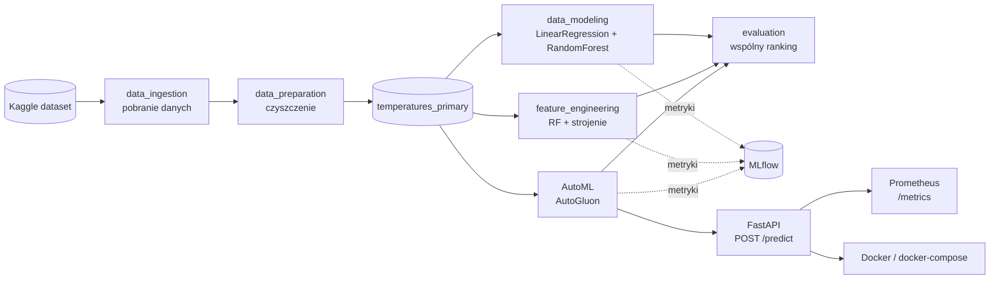

# Predykcja średniej temperatury — projekt ASI

[](https://kedro.org)
[](https://github.com/TGajewski09/ASI_projekt/actions/workflows/ci.yml)

Projekt zaliczeniowy na przedmiot **ASI (Architektury rozwiązań SI)**. Budujemy
kompletny system uczenia maszynowego: od surowych danych, przez pipeline
trenujący modele, po wdrożone API z monitoringiem i automatyzacją MLOps.

---

## 1. Opis problemu

Chcemy **przewidzieć średnią miesięczną temperaturę** (`AverageTemperature`, °C)
dla wybranego miejsca i czasu. To zadanie **regresji**: na wejściu podajemy rok,
miesiąc, współrzędne geograficzne i kraj, a model zwraca przewidywaną temperaturę.

Model może służyć np. do uzupełniania brakujących pomiarów albo jako prosty
„kalkulator klimatyczny" dla dowolnej lokalizacji.

## 2. Opis danych

Dane pochodzą z Kaggle: **[Climate Change: Earth Surface Temperature Data](https://www.kaggle.com/datasets/berkeleyearth/climate-change-earth-surface-temperature-data)**
(Berkeley Earth). Używamy pliku `GlobalLandTemperaturesByCity.csv` (~508 MB).

| Kolumna | Znaczenie |
|---|---|
| `dt` | data pomiaru (miesięcznie) |
| `AverageTemperature` | średnia temperatura w °C (cel modelu) |
| `AverageTemperatureUncertainty` | niepewność pomiaru |
| `City`, `Country` | miasto i kraj |
| `Latitude`, `Longitude` | współrzędne (w pliku jako tekst, np. `57.05N`) |

Po wyczyszczeniu danych zostaje **6 695 755 wierszy** ze **159 krajów**, zakres lat
**1850–2013**. Proces czyszczenia:

| Krok | Liczba wierszy |
|---|---|
| surowe dane | 8 599 212 |
| po usunięciu braków temperatury | 8 235 082 |
| po usunięciu duplikatów | 8 190 783 |
| po odfiltrowaniu lat < 1850 | **6 695 755** |

## 3. Architektura systemu



System składa się z kilku warstw:

- **Pipeline danych i modeli** — [Kedro](https://kedro.org): pobieranie, czyszczenie,
  inżynieria cech, trening i ewaluacja.
- **Śledzenie eksperymentów** — [MLflow](https://mlflow.org) (przez `kedro-mlflow`),
  baza `sqlite:///mlflow.db`.
- **AutoML** — [AutoGluon](https://auto.gluon.ai) automatycznie dobiera i łączy modele.
- **Serwowanie modelu** — [FastAPI](https://fastapi.tiangolo.com) (`POST /predict`).
- **Monitoring** — [Prometheus](https://prometheus.io) zbiera metryki API
  (liczba predykcji, rozkład wyników, opóźnienie, wykryty drift danych).
- **Konteneryzacja** — Docker + `docker-compose` (API + Prometheus).
- **MLOps** — GitHub Actions: CI (testy + linting), CD (publikacja obrazu),
  Continuous Training (ponowne trenowanie).

Szczegółowy opis i diagram do edycji: [`docs/architektura.md`](docs/architektura.md)
oraz [`docs/architecture.drawio`](docs/architecture.drawio).

## 4. Pipeline ML

Domyślny przebieg (`kedro run`) to trzy pipeline'y po kolei:

1. **`data_ingestion`** — pobiera dane z Kaggle do `data/01_raw` (jeśli ich brak).
2. **`data_preparation`** — usuwa braki i duplikaty, zamienia współrzędne na liczby,
   filtruje dane od 1850 r. → `temperatures_primary`.
3. **`data_modeling`** — buduje cechy, dzieli na train/test i trenuje dwa modele
   bazowe (LinearRegression, RandomForest), po czym je porównuje.

Osobno uruchamiane:

- **`feature_engineering`** — dodatkowe cechy (`decade`, `abs_latitude`,
  `country_label`), selekcja cech (RandomForest + SelectKBest) i strojenie
  hiperparametrów (`RandomizedSearchCV`).
- **AutoML** — `python automl_autogluon.py` (osobne środowisko, patrz niżej).
- **`evaluation`** — wspólny ranking wszystkich modeli wg RMSE.

## 5. Wyniki

Modele bazowe na zbiorze testowym (1 339 151 wierszy):

| Model | MAE | RMSE | R² |
|---|---|---|---|
| LinearRegression | 6.99 | 8.81 | 0.239 |
| **RandomForest** | **1.01** | **1.40** | **0.981** |

RandomForest przewiduje temperaturę średnio z błędem ok. 1 °C. Regresja liniowa
wypada słabo, bo zależność temperatury od pory roku i położenia jest nieliniowa.

## 6. Struktura repozytorium

```
ASI_projekt/
├── conf/                  # konfiguracja Kedro (katalog danych, parametry, MLflow)
├── data/                  # warstwy danych 01_raw … 08_reporting (ignorowane w gicie)
│   └── sample/            # mała próbka danych do Continuous Training
├── docs/                  # dokumentacja i diagram architektury
├── notebooks/             # notebooki (EDA, demo API)
├── scripts/               # skrypty pomocnicze (artefakty API, retrening)
├── src/new_kedro_project/
│   ├── pipelines/         # pipeline'y Kedro + serve.py (API)
│   └── ...
├── tests/                 # testy jednostkowe (pytest)
├── .github/workflows/     # CI / CD / Continuous Training
├── automl_autogluon.py    # AutoML (AutoGluon)
├── Dockerfile             # obraz API
└── docker-compose.yml     # API + Prometheus
```

## 7. Jak uruchomić

### Wymagania
Python 3.10+ (projekt rozwijany na 3.13).

### Instalacja
```bash
python -m venv .venv
# Windows:
.venv\Scripts\activate
# Linux / macOS:
source .venv/bin/activate

pip install -r requirements.txt
```

Do pobrania danych z Kaggle potrzebny jest token API zapisany w
`conf/local/kaggle.json` (instrukcja: [Kaggle API](https://www.kaggle.com/docs/api)).

### Uruchomienie pipeline'u
```bash
kedro run                              # domyślny przebieg (ingestion + preparation + modeling)
kedro run --pipeline feature_engineering
kedro run --pipeline evaluation
```

### Podgląd eksperymentów w MLflow
```bash
mlflow ui --backend-store-uri sqlite:///mlflow.db    # http://127.0.0.1:5000
```

### Wizualizacja pipeline'u (Kedro-Viz)
```bash
kedro viz
```

### API (predykcja temperatury)
Najprościej przez Dockera (sam zbuduje obraz i podłączy model):
```bash
docker compose up --build
# API:        http://localhost:8000/docs
# Prometheus: http://localhost:9090
```

Lub lokalnie (wymaga `pip install -r requirements-serve.txt`):
```bash
uvicorn new_kedro_project.pipelines.serve:app --app-dir src --port 8000
```

Przykładowe zapytanie:
```bash
curl -X POST "http://localhost:8000/predict?year=2013&month=7&latitude=52.23&longitude=21.0&country=Poland"
```

### Testy i linting
```bash
pytest            # testy jednostkowe
ruff check .      # linting
```

## 8. MLOps (CI / CD / Continuous Training)

W katalogu `.github/workflows/`:

- **`ci.yml`** — na każdy push i pull request: `ruff check` + `pytest`.
- **`cd.yml`** — po wejściu zmian na `main`: budowa obrazu Docker z API
  i publikacja w GitHub Container Registry (GHCR).
- **`continuous-training.yml`** — ręcznie lub co tydzień: ponowne trenowanie
  modelu (`scripts/retrain.py`) na próbce danych i zapis wyniku jako artefakt.

## 9. Demo

Działanie projektu można zobaczyć na dwa sposoby:

- **API** — `docker compose up --build` i zapytania na `http://localhost:8000/docs`.
- **Notebook** — [`notebooks/demo_api.ipynb`](notebooks/demo_api.ipynb) z przykładowymi
  predykcjami i wykrywaniem driftu.
