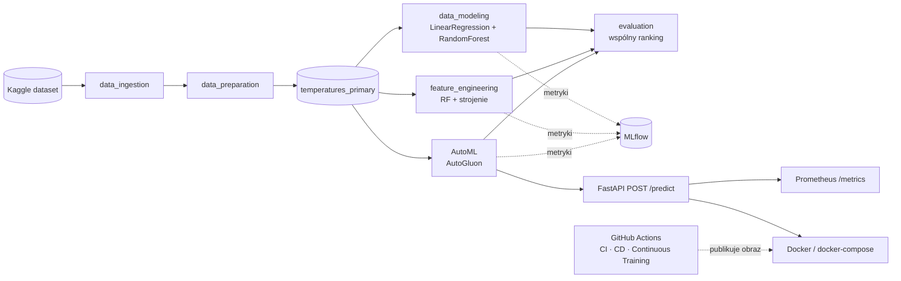

# Architektura systemu

Dokument opisuje, z czego składa się projekt i jak przepływają dane — od
surowego pliku z Kaggle, przez trening modeli, po wdrożone API z monitoringiem.

Diagram do edycji: [`architecture.drawio`](architecture.drawio) (otwórz na
[diagrams.net](https://app.diagrams.net)). Wersja podglądowa: [`architecture.svg`](architecture.svg).

## Diagram



## Komponenty

| Komponent | Technologia | Rola |
|---|---|---|
| Pobieranie danych | Kaggle API | ściąga dataset do `data/01_raw` |
| Pipeline ML | Kedro | czyszczenie, cechy, trening, ewaluacja |
| Śledzenie eksperymentów | MLflow (`kedro-mlflow`) | metryki i artefakty modeli |
| AutoML | AutoGluon | automatyczny dobór i łączenie modeli |
| API | FastAPI + Uvicorn | endpoint `POST /predict` |
| Monitoring | Prometheus | metryki API i wykrywanie driftu |
| Konteneryzacja | Docker, docker-compose | uruchomienie API + Prometheus |
| Automatyzacja | GitHub Actions | CI / CD / Continuous Training |

## Przepływ danych (warstwy Kedro)

Dane przechodzą przez kolejne katalogi w `data/` (konwencja Kedro):

```
01_raw → 02_intermediate → 03_primary → 04_feature → 05_model_input → 06_models → 08_reporting
surowe    częściowo czyste   gotowe do      cechy        train / test     modele       raporty,
                             modelowania                                                metryki
```

- **01_raw** — oryginalny CSV z Kaggle.
- **02_intermediate** — kolejne etapy czyszczenia (bez braków, bez duplikatów,
  z policzonymi współrzędnymi).
- **03_primary** — `temperatures_primary`: czysty zbiór wejściowy do modeli.
- **04_feature / 05_model_input** — cechy oraz podział na zbiór treningowy i testowy.
- **06_models** — zapisane modele (sklearn, AutoGluon) i pliki pomocnicze API.
- **08_reporting** — raporty i metryki (część logowana też do MLflow).

## Decyzje architektoniczne

- **Batch, nie real-time.** Trening to przetwarzanie wsadowe na pełnych danych
  (offline). API obsługuje pojedyncze zapytania w czasie rzeczywistym, ale model
  jest gotowy wcześniej — nie trenujemy „na żądanie".
- **Model serwowany przez wolumen.** Model AutoGluon waży kilka GB, więc nie jest
  „wpisany" w obraz Dockera. Obraz zawiera tylko kod API i małe pliki pomocnicze,
  a model podłączamy z dysku przez wolumen (`docker-compose.yml`). Dzięki temu
  obraz buduje się szybko i da się go zbudować automatycznie w CI/CD.
- **Leniwe ładowanie modelu.** `serve.py` ładuje model dopiero przy pierwszym
  zapytaniu, więc moduł można zaimportować w testach bez ciężkich bibliotek.
- **Bez cechy `Country`.** Położenie opisują współrzędne (`Latitude`,
  `Longitude`), więc kraj byłby informacją nadmiarową — model go nie używa.

## Monitoring i drift

API wystawia metryki Prometheus na `/metrics`:

- `model_predictions_total` — liczba wykonanych predykcji,
- `model_prediction_value_celsius` — rozkład przewidywanych temperatur,
- `model_prediction_latency_seconds` — czas odpowiedzi,
- `model_input_drift_total` — liczba zapytań z danymi spoza zakresu treningowego.

**Drift** wykrywamy prosto: dla każdego zapytania sprawdzamy, czy rok, miesiąc
i współrzędne mieszczą się w zakresach ze zbioru treningowego (plik
`drift_baseline.json`). Jeśli nie — oznaczamy to w odpowiedzi i zliczamy w metryce.
